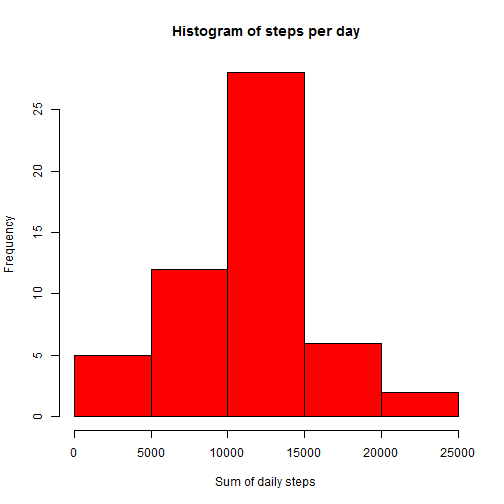
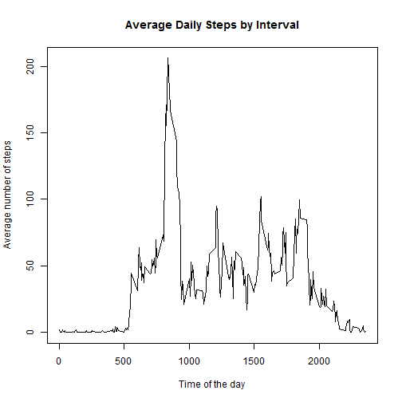
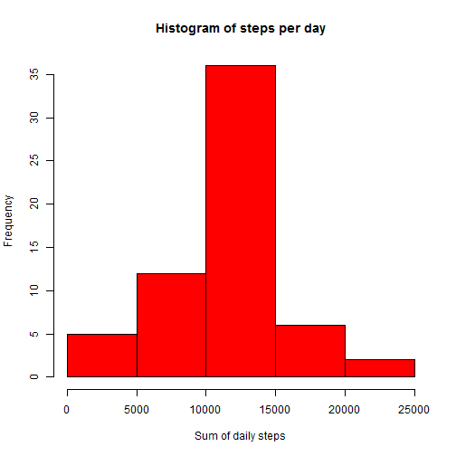
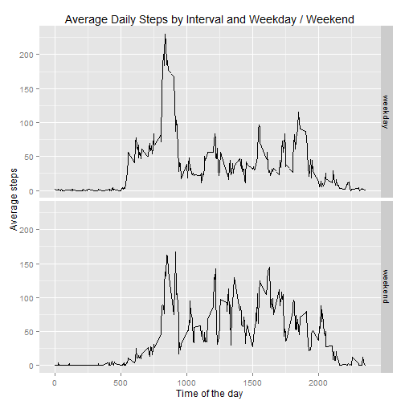
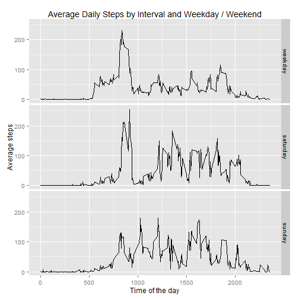

## Loading and preprocessing the data
Firstly, let's unzip the data:

```r
unzip("repdata_data_activity.zip")
```
And now load the data into R:

```r
activity <- read.csv(file="activity.csv", header=TRUE)
```
The data now looks like this:

```r
head(activity)
```

```
##   steps       date interval
## 1    NA 2012-10-01        0
## 2    NA 2012-10-01        5
## 3    NA 2012-10-01       10
## 4    NA 2012-10-01       15
## 5    NA 2012-10-01       20
## 6    NA 2012-10-01       25
```

```r
tail(activity)
```

```
##       steps       date interval
## 17563    NA 2012-11-30     2330
## 17564    NA 2012-11-30     2335
## 17565    NA 2012-11-30     2340
## 17566    NA 2012-11-30     2345
## 17567    NA 2012-11-30     2350
## 17568    NA 2012-11-30     2355
```

## What is mean total number of steps taken per day?
In order to calculate the mean, let's use the dplyr package:

```r
library("dplyr")
```

```
## 
## Attaching package: 'dplyr'
## 
## Die folgenden Objekte sind maskiert von 'package:stats':
## 
##     filter, lag
## 
## Die folgenden Objekte sind maskiert von 'package:base':
## 
##     intersect, setdiff, setequal, union
```
Now we can group the data by date and put into a new variable called *steps_by_day*:

```r
steps_by_day <- group_by(activity, date)
```
Applying the sum function to the steps will now deliver the result we war looking for. Let's put into *dailysteps* and look at it:

```r
dailysteps <- summarise(steps_by_day, steps=sum(steps))
head(dailysteps)
```

```
## Source: local data frame [6 x 2]
## 
##         date steps
##       (fctr) (int)
## 1 2012-10-01    NA
## 2 2012-10-02   126
## 3 2012-10-03 11352
## 4 2012-10-04 12116
## 5 2012-10-05 13294
## 6 2012-10-06 15420
```
We can remove the NAs by using the complete.cases function. Let's do it and observe the change:

```r
dailysteps <- dailysteps[complete.cases(dailysteps),]
head(dailysteps)
```

```
## Source: local data frame [6 x 2]
## 
##         date steps
##       (fctr) (int)
## 1 2012-10-02   126
## 2 2012-10-03 11352
## 3 2012-10-04 12116
## 4 2012-10-05 13294
## 5 2012-10-06 15420
## 6 2012-10-07 11015
```

The data is now ready to produce a Histogram:

```r
hist(dailysteps$steps, main="Histogram of steps per day", xlab="Sum of daily steps", col="red")
```

 

Now, let's find the median and mean of the daily steps:

```r
median(dailysteps$steps)
```

```
## [1] 10765
```

```r
mean(dailysteps$steps)
```

```
## [1] 10766.19
```


## What is the average daily activity pattern?
To answer this question, let's group the data by intervals, remove the NAs and have a look at it:

```r
steps_by_interval <- group_by(activity, interval)
steps_by_interval <- steps_by_interval[complete.cases(steps_by_interval),]
head(steps_by_interval)
```

```
## Source: local data frame [6 x 3]
## Groups: interval [6]
## 
##   steps       date interval
##   (int)     (fctr)    (int)
## 1     0 2012-10-02        0
## 2     0 2012-10-02        5
## 3     0 2012-10-02       10
## 4     0 2012-10-02       15
## 5     0 2012-10-02       20
## 6     0 2012-10-02       25
```
Similarly as before, we can now create the mean for each interval and store it into a variable called *intervalsteps* and look at it:

```r
intervalsteps <- summarise(steps_by_interval, steps = mean(steps))
head(intervalsteps)
```

```
## Source: local data frame [6 x 2]
## 
##   interval     steps
##      (int)     (dbl)
## 1        0 1.7169811
## 2        5 0.3396226
## 3       10 0.1320755
## 4       15 0.1509434
## 5       20 0.0754717
## 6       25 2.0943396
```
The data looks ready for plotting:

```r
plot(x=intervalsteps$interval, y=intervalsteps$steps, type="l", main="Average Daily Steps by Interval", xlab="Time of the day", ylab="Average number of steps")
```

 

Now, the which.max function helps us to find the maximum number of average steps. It returns the position, which we can use to subset *intervalsteps*:

```r
intervalsteps[which.max(intervalsteps$steps),]
```

```
## Source: local data frame [1 x 2]
## 
##   interval    steps
##      (int)    (dbl)
## 1      835 206.1698
```
The result shows us that the maximum number of average daily steps is slightly more than 206 steps and occurs at the 835 interval (which can be assumed to occur between 08:35 and 08:40).

## Imputing missing values
Until now we have ignored missing data **NA** and simply excluded them completey frm the dataset. Now that we know an daily average for eac interval, we could use it to fill the missing values in the original data. First, let's look at the original data and find out how many **NAs** we are facing:

```r
sum(is.na(activity$steps))
```

```
## [1] 2304
```
Seeing that we are facing not less than 2304 **NA**-values it might be worth the effort. 
Let's start by creating a new dataset called *activity_complete*. To be absolutely sure it is the original data and not altered in any way by previous code, let's invest the time and read the source file again:

```r
activity_complete <- read.csv(file="activity.csv", header=TRUE)
```
So let's replace the **NAs** by the average value for that intervals rounded to full steps. I'll use the modulo function *%%* to determine the appropriate interval, which will work nicely for all intervals except the last one. I'll have to manually fix that:

```r
for (i in 1:nrow(activity_complete)) {
        ## find the corresponding interval position
        pos <- i%%288
        ## fix all multiples of 288:
        if(pos==0)pos<-288
        ## replace NAs
        if(is.na(activity_complete[i,1])) activity_complete[i,1]<- round(intervalsteps[pos,2])
        } 
```
A quick check shows that all **NAs** are gone:

```r
sum(is.na(activity_complete$steps))
```

```
## [1] 0
```
Now let's make the histogram with the filled in data in a similar fashion as above:

```r
steps_by_day_complete <- group_by(activity_complete, date)
dailysteps_complete <- summarise(steps_by_day_complete, steps=sum(steps))
hist(dailysteps_complete$steps, main="Histogram of steps per day", xlab="Sum of daily steps", col="red")
```

 

It looks strikingly similar to the first histogram, only the length of one bar has increased. To find out why, let's aggregate the number of **NAs** by day and have a look at them:

```r
na_by_day <-aggregate(steps ~ date, data=activity, function(x) {sum(is.na(x))}, na.action = na.pass)
na_by_day
```

```
##          date steps
## 1  2012-10-01   288
## 2  2012-10-02     0
## 3  2012-10-03     0
## 4  2012-10-04     0
## 5  2012-10-05     0
## 6  2012-10-06     0
## 7  2012-10-07     0
## 8  2012-10-08   288
## 9  2012-10-09     0
## 10 2012-10-10     0
## 11 2012-10-11     0
## 12 2012-10-12     0
## 13 2012-10-13     0
## 14 2012-10-14     0
## 15 2012-10-15     0
## 16 2012-10-16     0
## 17 2012-10-17     0
## 18 2012-10-18     0
## 19 2012-10-19     0
## 20 2012-10-20     0
## 21 2012-10-21     0
## 22 2012-10-22     0
## 23 2012-10-23     0
## 24 2012-10-24     0
## 25 2012-10-25     0
## 26 2012-10-26     0
## 27 2012-10-27     0
## 28 2012-10-28     0
## 29 2012-10-29     0
## 30 2012-10-30     0
## 31 2012-10-31     0
## 32 2012-11-01   288
## 33 2012-11-02     0
## 34 2012-11-03     0
## 35 2012-11-04   288
## 36 2012-11-05     0
## 37 2012-11-06     0
## 38 2012-11-07     0
## 39 2012-11-08     0
## 40 2012-11-09   288
## 41 2012-11-10   288
## 42 2012-11-11     0
## 43 2012-11-12     0
## 44 2012-11-13     0
## 45 2012-11-14   288
## 46 2012-11-15     0
## 47 2012-11-16     0
## 48 2012-11-17     0
## 49 2012-11-18     0
## 50 2012-11-19     0
## 51 2012-11-20     0
## 52 2012-11-21     0
## 53 2012-11-22     0
## 54 2012-11-23     0
## 55 2012-11-24     0
## 56 2012-11-25     0
## 57 2012-11-26     0
## 58 2012-11-27     0
## 59 2012-11-28     0
## 60 2012-11-29     0
## 61 2012-11-30   288
```
Here we can see eight days with 288 **NAs** each and none among the rest of the days. The data is complete for all except eight days, which in turn are completely missing. We have now imputed these eight days with values representing an average day. Consequently, the bar in the histogram which contains the sum of all steps of an average day grew, which is of course the middle one.

Now, let's find the median and mean of the daily steps with the missing data imputed:

```r
median(dailysteps_complete$steps)
```

```
## [1] 10762
```

```r
mean(dailysteps_complete$steps)
```

```
## [1] 10765.64
```
For comparison, the values before imputing were:

```r
median(dailysteps$steps)
```

```
## [1] 10765
```

```r
mean(dailysteps$steps)
```

```
## [1] 10766.19
```
The change is minimal, which was to be expected, as we imputed values corresponding to an average day.

## Are there differences in activity patterns between weekdays and weekends?
To find out which days are weekdays or weekends we first need to convert the *date* variable from a factor into a date:

```r
activity_complete$date <- as.Date(x = as.character(activity_complete$date), format = "%Y-%m-%d")
```
Now, let's use dplyr again to create a new variable to indicate whether the day is a weekday or weekend. For this purpose, let's find the weekday as a number between 1 and 7 and decide that days number 6 and 7 (Saturday and Sunday) are weekend days:

```r
activity_complete <- mutate(activity_complete, weekday = strftime(date, format="%u"), partofweek = as.factor(ifelse(weekday<6, "weekday","weekend")))
```
First, we need to group the values by interval and whether it is weekday or weekend. Then, we can create the mean of the steps by interval and part of the week.

```r
steps_by_interval_complete <- group_by(activity_complete, interval,partofweek)
intervalsteps_complete <- summarise(steps_by_interval_complete, steps = mean(steps))
```
Let's plot the numbers using the ggplot2 library:

```r
library("ggplot2")
plot<- ggplot(intervalsteps_complete,aes(interval,steps)) +
        geom_line() +
        facet_grid(partofweek~.) +
        labs(x="Time of the day",y="Average steps", title="Average Daily Steps by Interval and Weekday / Weekend")
print(plot)
```

 

Although largely similar, there is a visible differnce during the morning hours. Maybe the difference would be even more pronunced if we treated the Saturday as a weekday (which for example is true in German Traffic law). To explore it further, let's look at Saturday and Sunday separately:

```r
activity_complete <- mutate(activity_complete, weekday = strftime(date, format="%u"), partofweek = factor(ifelse(weekday==7, "sunday",ifelse(weekday==6, "saturday","weekday")),levels=c("weekday","saturday","sunday")))
steps_by_interval_complete <- group_by(activity_complete, interval,partofweek)
intervalsteps_complete <- summarise(steps_by_interval_complete, steps = mean(steps))
plot<- ggplot(intervalsteps_complete,aes(interval,steps)) +
        geom_line() +
        facet_grid(partofweek~.) +
        labs(x="Time of the day",y="Average steps", title="Average Daily Steps by Interval and Weekday / Weekend")
print(plot)
```

 

Indeed, the Sunday is clearly more different from the weekdays than the Saturday. I hope you enjoyed this little exploration of the given dataset. :-)
